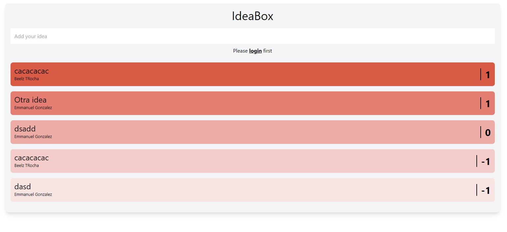
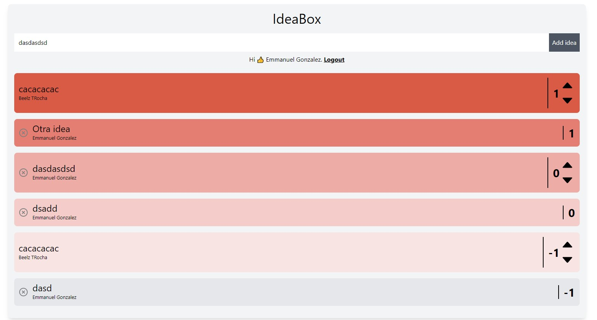

# **Vue idea box**

It is an idea management system. People can view the ideas created by the community, and if they log in they can vote for them and create their own. ✍💡🗒

## **Table of contents**

- [**Vue idea box**](#vue-idea-box)
    - [**Table of contents**](#table-of-contents)
    - [**General info**](#general-info)
    - [**Demo**](#demo)
    - [**Screenshots**](#screenshots)
    - [**Technologies**](#technologies)
    - [**Setup**](#setup)
    - [**Usage**](#usage)
    - [**Status**](#status)
    - [**Contact**](#contact)

## **General info**

**Date**: January, 2021  
**Duration**: 1 Week.

It's part of the course [EscuelaVue](https://escuelavue.es/).

## **Demo**

You can try it using the [Demo](https://vue-idea-box.netlify.app/)

## **Screenshots**

> <br><i>Index</i>

> <br><i>Dynamic route</i>

## **Technologies**

- [**Vue 3**](https://v3.vuejs.org/)
- [**Firebase**](https://firebase.google.com/)
  - [**Auth**](https://firebase.google.com/docs/auth)
  - [**Firestore**](https://firebase.google.com/docs/firestore)
- [**Tailwindcss**](https://tailwindcss.com/)

## **Setup**

1. Rename ".env.local.example" to ".env.local" and replace the values by your firebase configuration.

```
VUE_APP_FIREBASE_API_KEY=YOUR_KEY
VUE_APP_FIREBASE_AUTH_DOMAIN=YOUR_AUTH_DOMAIN
VUE_APP_FIREBASE_PROJECT_ID=YOUR_PROJECT_ID
VUE_APP_FIREBASE_STORAGE_BUCKET=YOUR_STORAGE_BUCKET
VUE_APP_FIREBASE_MESSAGING_SENDER_ID=YOUR_MESSAGING_SENDER_ID
VUE_APP_FIREBASE_APP_ID=YOUR_APP_ID
```

2. Clone/Download the repository.

```console
git clone https://github.com/udsgit/idea-box
```

3. You may have to install the packages with **NPM**.

```console
npm install
```

4. Serve to local.

```console
npm run serve
```

## **Usage**

1. Open the link from the [Demo](https://vue-idea-box.netlify.app/) or execute the serve with the steps above.
2. When you log in for the first time, you will only be able to see ideas created by the community. And if you decide to log in, you can create your own ideas and vote for the rest.

## **Status**

Project is: **_Completed._**

Since it has been part of a course, which has been completed.

## **Contact**

Created by [@Emmanuel](https://www.linkedin.com/in/emagleza/), feel free to contact me!

